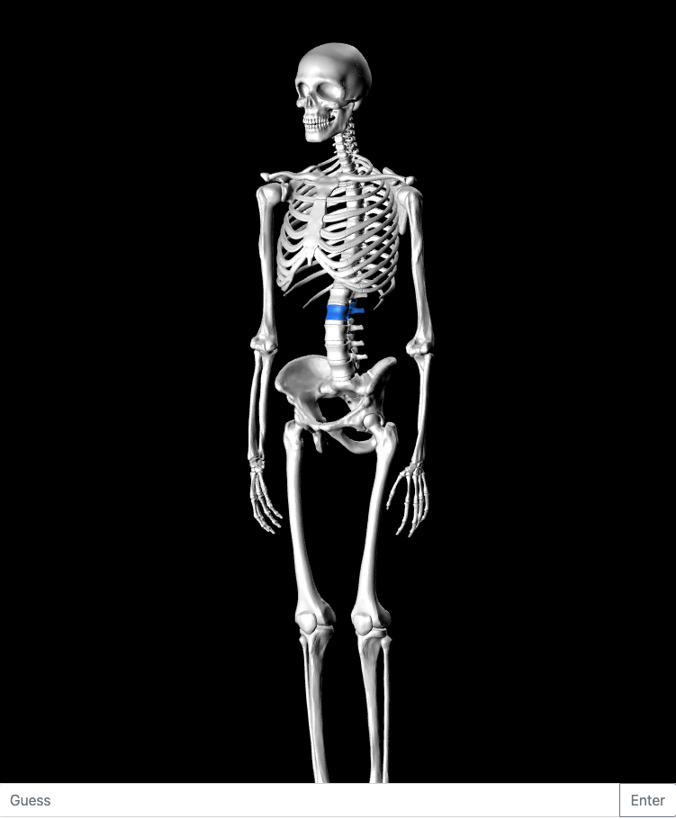
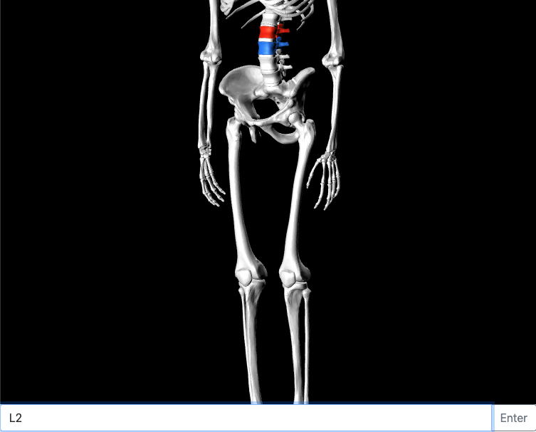

# Anatomy Quiz Game

## This is sort of like a globle game but focused on anatomy. Each time there is a section of the skeleton that is selected as the "hidden" target (for now it's blue just to test) and you will guess different bones until you get the correct answer. Each guess is colored yellow to red depending on how close it is to the target (red is the closest, yellow furthest away).

### Example initial screen (vertabrate L3 is the hidden target in blue)

### Example photo shown after guessing L2 (close to L3 so very red)

